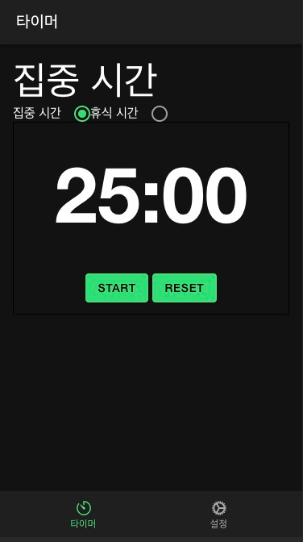

# Pomodoro Timer App

## Overview
Pomodoro Timer app....




## Features
- 집중 시간 설정
- 휴식 시간 설정
- 재생/일시 정지 기능
- 타이머 초기화
- 집중과 휴식 기간을 위한 배경 음악

## How to Use
1. 앱을 열면 메인 화면이 표시됩니다.
2. 설정에서 집중 및 휴식 시간 간격을 설정할 수 있습니다.
3. '시작'을 클릭하면 타이머가 시작됩니다.
4. '일시 정지'를 클릭하면 타이머가 일시 정지됩니다.
5. '초기화'를 클릭하면 타이머가 초기화됩니다.

## Installation
이 저장소를 클론하고 선호하는 IDE로 가져옵니다.
그런 다음 `npm install`을 실행하여 종속성을 설치합니다.

```bash
git clone https://github.com/your-repo/pomodoro-timer.git
cd pomodoro-timer
npm install
```

## Built With
* ReactJS
* Ionic Framework
